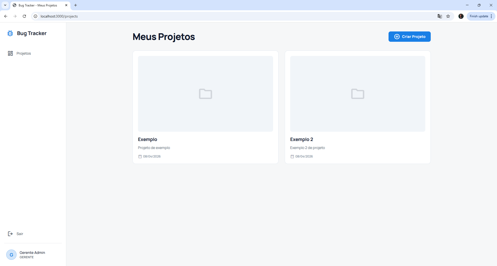
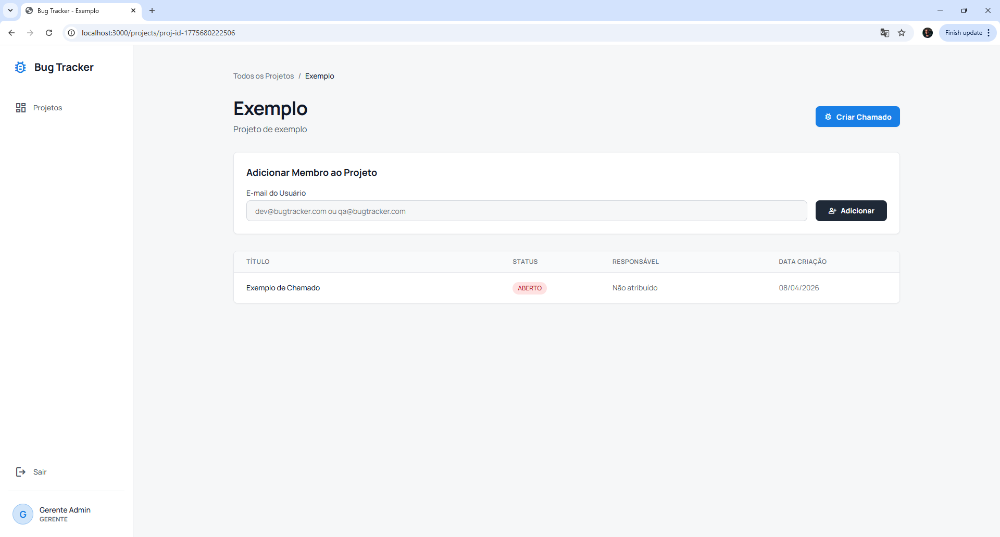
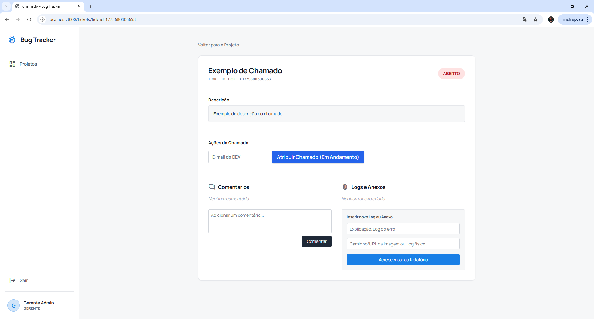
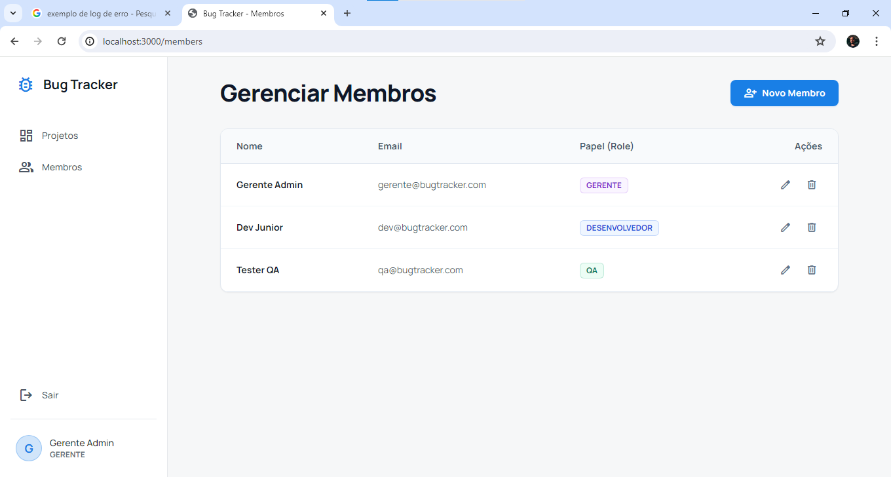

# Sistema de Rastreamento de Bugs (Bug Tracker)

## Descrição do Tema
Este projeto consiste em uma API RESTful para um Sistema de Rastreamento de Bugs (Bug Tracker), desenvolvida como requisito de avaliação acadêmica. O sistema permite o gerenciamento completo do ciclo de vida de falhas de software, englobando a criação de projetos, controle de acesso baseado em perfis (Gerente, Desenvolvedor e QA), abertura de chamados (tickets), atribuição de responsáveis e inclusão de logs (comentários) e metadados de anexos. 

O diferencial técnico desta aplicação é a sua estruturação baseada nos princípios da **Clean Architecture** (Arquitetura Limpa). O código está rigorosamente separado em camadas de Domínio, Aplicação, Interfaces e Infraestrutura, garantindo que as regras de negócio sejam isoladas de frameworks externos. A aplicação também implementa uma Máquina de Estados para garantir a transição segura e lógica dos status dos chamados.

Tecnologias utilizadas: Node.js, TypeScript, Express, Prisma ORM, SQLite e Bcryptjs.

---

## Diagrama de Classes e Entidade-Relacionamento
Abaixo está a representação estrutural das entidades do domínio e como elas se relacionam no banco de dados. O Chamado (Ticket) atua como a Raiz de Agregação para Comentários e Anexos.


---

## Exemplo de Chamada (Principal POST do Sistema)
O núcleo do sistema é a abertura de um chamado (Ticket). Abaixo está o exemplo do payload (JSON) necessário para a criação de um bug, relacionando-o a um Projeto e a um Usuário (Reportador).

**Endpoint:** `POST /api/v1/tickets`


**Corpo da Requisição (JSON):**
```json
{
  "title": "Falha de autenticação na tela principal",
  "description": "Ao inserir credenciais válidas e clicar em 'Entrar', o sistema retorna erro 500 intermitente e não redireciona para o dashboard.",
  "reporterId": "id-do-usuario-qa-gerado-no-banco",
  "projectId": "id-do-projeto-gerado-no-banco"
}
```

**Resposta de Sucesso (201 Created):**
```json
{
  "id": "uuid-gerado-automaticamente",
  "title": "Falha de autenticação na tela principal",
  "description": "Ao inserir credenciais válidas e clicar em 'Entrar', o sistema retorna erro 500 intermitente e não redireciona para o dashboard.",
  "status": "ABERTO",
  "reporterId": "id-do-usuario-qa-gerado-no-banco",
  "projectId": "id-do-projeto-gerado-no-banco",
  "createdAt": "2023-10-27T10:00:00.000Z"
}
```

## Testes de Endpoint (Postman / Insomnia)

Para facilitar a avaliação e validação de todas as rotas da aplicação (criação de usuários, autenticação, projetos, chamados e máquina de estados), foi disponibilizada uma coleção completa de requisições.

O arquivo contendo a coleção encontra-se no repositório no seguinte caminho: [/Docs/BugTracker.postman_collection.json](BugTracker.postman_collection.json)

## Instruções de uso:
1. Abra o Postman ou Insomnia.
2. Selecione a opção Import e arraste o arquivo ```BugTracker.postman_collection.json```.
3. Atenção à URL base: As requisições na coleção estão configuradas com uma URL de exemplo do Codespaces. Substitua a URL base das requisições pela URL gerada no seu ambiente (veja as instruções de execução abaixo).
4. Execute as requisições respeitando a ordem lógica (Criar Usuários -> Autenticar -> Criar Projeto -> Criar Ticket (Opcional: Add Comment, Add Attachment - metadado) -> Atualizar Ticket).

## Como executar o projeto localmente

1. Clone o repositório ou abra o Codespace na branch correta.
2. No terminal, caso seja a primeira vez, entre na pasta do backend e instale as dependências:
```bash
cd apps/backend
npm install
```

3. Em seguida, execute as migrações para criar as tabelas e popular os usuários básicos de teste no banco de dados SQLite:
```bash
npx prisma migrate dev
```

**Dica Extra (Apagar e recriar os dados de teste):** 
Caso o seu banco fique muito poluído e você queira destruir o banco de dados e recriá-lo do zero incluindo os 3 perfis fictícios novamente (`gerente@bugtracker.com`, `dev@...`, etc com senha `123456`), execute:
```bash
npx prisma migrate reset --force
```

4. Por fim, inicie o servidor:
```bash
npm run dev
```

Abra o seu navegador no link local `http://localhost:3000` (ou na port-forwarding do Github Codespaces) para visualizar a interface.

---

## Demonstração (Vídeo)
Para entender de forma objetiva todo o percurso e fluxo de interações deste sistema em formato MVP, veja nosso vídeo de demonstração completo:

▶️ **[Clique aqui para assistir ao Vídeo Mapeando a Aplicação](#link-placeholder)**

---

## Guia de Telas
Aqui estão as principais interfaces desenvolvidas dinamicamente (SSR) provendo a acessibilidade às funcionalidades do Back-end.

* **Login**:
  
* **Projects Dashboard**: 
  
* **Project Details**:
  
* **Ticket Management**:
  
* **Users Management**:
  

---

## Release Oficial
Esta documentação é referida a versão 2.0 (Final) desta aplicação.